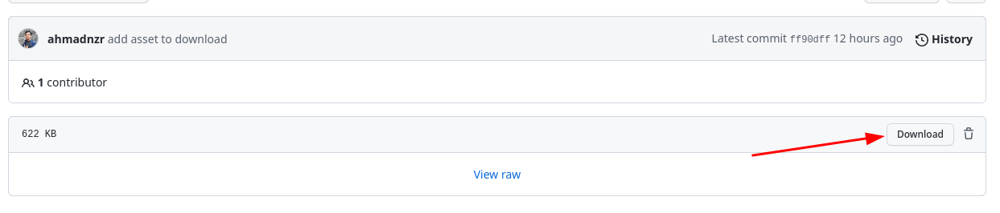

# Getting Started

Yuk siapkan dulu requirement-nya :

## Instalasi Git

Disini akan saya jelaskan cara menginstall git di sistem operasi `windows` dan `linux`

### Linux

untuk linux biasanya sudah terinstall atau otomatis include di install ketika nginstall OS-nya, tapi tidak masalah jika belum terinstall, berikut cara installnya

- untuk **Debian, Ubuntu, dkk**

```
sudo apt install git-all
```

- untuk **CentOs, dkk**

```
sudo dnf install git-all
```

- untuk **Arch, dkk**

```
yay -S git-git
```
sebelumnya install dulu **yay** yah. 

### Windows

- Ikuti link berikut ini:
[Link Download git](https://git-scm.com/download/win)

- setelah di download, tinggal diinstall manual aja ya. install sendiri ya >_< saya pake linux eee.

## Daftar Git Services
ada banyak git service yang tersedia, tapi kali ini kita akan menggunakan salah satunya saja yaitu **Github**. untuk mendaftar mudah saja:

- buka link init [LINK](https://github.com/)
- lalu pilih Sign-Up. klo kalian sudah daftar tinggal Sign-in aja
- terus ikuti langkah-langkah ya sampai habis. >_<


## Assets

silahkan download asset berikut, nanti kita akan sambil ngoding memperbaiki web dan menyimpan setiap perubahan di git.

[`1-getting-started-with-git.zim`](../assets/1-getting-started-with-git.zip).

jika gak langsung ke download, klo tombol download:



## Instructions

Nanti kita bakal ngoding bareng, jadi silahkan install git dan download asset diatas agar semuanya lancar ntr. 
